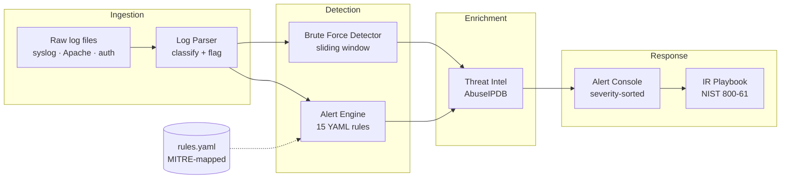

<div align="center">


<br/>


<br/>

[](explain/index.html)
[](quiz/index.html)
[](dashboard/index.html)

</div>

---

## Executive Overview

**SentinelPulse** is a Security Operations Center analytics pipeline built from scratch in Python. It ingests raw syslog and Apache access logs, classifies every line, runs YAML-driven detection rules mapped to MITRE ATT&CK, and enriches the resulting alerts with live IP reputation from AbuseIPDB.

Every tool solves a real problem — the same problems SOC analysts face daily. No magic, no black boxes: read the rules, read the code, understand the detection logic end to end.

| Capability | What it does |
|---|---|
| **Log Parsing** | Classifies syslog / Apache / SSH-auth lines, flags suspicious keywords, emits structured JSON |
| **Detection Engine** | 15 YAML rules with field matching, HTTP status constraints and per-rule thresholds |
| **Brute Force Detection** | Sliding-window analysis — attack *density*, not just raw counts |
| **Threat Intelligence** | AbuseIPDB enrichment with abuse confidence scores and category attribution |
| **Hash Checking** | MD5/SHA-1/SHA-256 identification and IOC matching |
| **IR Playbook** | NIST SP 800-61 aligned response procedures per alert type |
| **Automation** | Daily scans and weekly maintenance via GitHub Actions |

---

## System Architecture



**Data flow:** raw logs → structured JSON → rule correlation → MITRE-tagged alerts → reputation enrichment → triage and response.

---

## The Modules

### Log Parser — `soc/log_parser/`

Reads raw log files line by line. Detects whether each line is SSH auth, Apache access or generic syslog. Flags anything suspicious. Outputs structured JSON.

```bash
python soc/log_parser/parser.py --file soc/log_parser/sample.log --output parsed.json
```

```
Total log entries : 19
Suspicious events : 11

--- Suspicious entries ---
  [syslog] Failed password for root from 89.248.167.131 port 55988 ssh2
  [syslog] Invalid user jenkins from 89.248.167.131
  [apache] GET /../etc/passwd HTTP/1.1 — directory traversal attempt
```

### Alert Engine — `soc/alert_rules/`

Runs YAML detection rules against the parsed output. Every rule maps to a MITRE ATT&CK technique so every alert tells you what the attacker is trying to accomplish. Alerts are deduplicated and severity-sorted for triage.

```bash
python soc/alert_rules/alert_engine.py --logs parsed.json --rules soc/alert_rules/rules.yaml
```

```
[CRITICAL] SQL Injection Probe (RULE-012)
  MITRE ATT&CK : T1190 - Exploit Public-Facing Application (Initial Access)
  Log entry    : GET /search?q=1' OR '1'='1 — sqlmap/1.7 fingerprint

[HIGH] Brute Force Detected (RULE-BF)
  MITRE ATT&CK : T1110 - Brute Force (Credential Access)
  Log entry    : Source IP 89.248.167.131 had 9 failed login attempts
```

### Brute Force Detector — `soc/brute_force_detector/`

Uses a sliding time window with a two-pointer sweep. Nine attempts in 30 seconds is treated very differently to nine attempts over three days — because attack rate matters more than total count.

```bash
python soc/brute_force_detector/detector.py --file soc/log_parser/sample.log --threshold 5 --window 300
```

```
Brute Force Detection Report
Threshold : 5 attempts within 300 seconds

FLAGGED IPs:
  89.248.167.131     9 in window / 9 total   BLOCK RECOMMENDED
```

### Threat Intelligence — `soc/alert_rules/threat_intel.py`

Checks every source IP against AbuseIPDB with rate limiting and timeouts. A 97% abuse confidence score changes a suspicious login into a confirmed targeted attack from a known threat actor.

```bash
export ABUSEIPDB_KEY=your_key_here
python soc/alert_rules/threat_intel.py --logs parsed.json
```

### Hash Checker — `soc/hash_checker/`

Identifies hash algorithms by length, computes file digests and matches against known IOCs — quick triage during incident response.

```bash
python soc/hash_checker/hash_checker.py --hash 44d88612fea8a8f36de82e1278abb02f
python soc/hash_checker/hash_checker.py --file suspicious.bin
```

### Dashboards

A terminal overview for quick pulse-checks, plus a web alert console with severity, technique and status filtering:

```bash
python soc/dashboard/dashboard.py --logs parsed.json
```

---

## MITRE ATT&CK Coverage

| Tactic | Technique | ID | Rule | Severity |
|---|---|---|---|---|
| Reconnaissance | Vulnerability Scanning | T1595.002 | RULE-011 | Medium |
| Initial Access | Valid Accounts | T1078 | RULE-002 | Medium |
| Initial Access | Exploit Public-Facing Application | T1190 | RULE-005 / 009 / 012 | Medium → Critical |
| Execution | Exploitation for Client Execution | T1203 | RULE-006 | Medium |
| Execution | Command and Scripting Interpreter: JavaScript | T1059.007 | RULE-015 | High |
| Discovery | Network Service Discovery | T1046 | RULE-008 / 013 | Medium / High |
| Discovery | File and Directory Discovery | T1083 | RULE-010 | High |
| Credential Access | Brute Force | T1110 | RULE-001 / 007 / BF | High |
| Credential Access | Credential Stuffing | T1110.004 | RULE-004 | High |
| Credential Access | Unsecured Credentials: In Files | T1552.001 | RULE-014 | High |
| Privilege Escalation | Valid Accounts | T1078 | RULE-003 | Medium |

The full incident response playbook with step-by-step procedures for each scenario is in [`soc/incident_response/playbook.md`](soc/incident_response/playbook.md).

---

## Project Structure

```
sentinelpulse/
├── soc/
│   ├── log_parser/
│   │   ├── parser.py               # reads and classifies every log line
│   │   ├── generate_logs.py        # generates realistic test logs
│   │   └── sample.log              # latest generated log file
│   ├── alert_rules/
│   │   ├── rules.yaml              # 15 detection rules with MITRE mapping
│   │   ├── alert_engine.py         # runs logs against the rules
│   │   └── threat_intel.py         # AbuseIPDB IP reputation lookup
│   ├── brute_force_detector/
│   │   └── detector.py             # sliding-window brute force detection
│   ├── hash_checker/
│   │   └── hash_checker.py         # hash identification and IOC matching
│   ├── dashboard/
│   │   ├── dashboard.py            # terminal overview
│   │   └── index.html              # web alert console with filtering
│   └── incident_response/
│       └── playbook.md             # NIST SP 800-61 IR procedures
├── explain/
│   └── index.html                  # interactive SOC field guide
├── quiz/
│   └── index.html                  # blue team knowledge quiz
├── tests/                          # pytest suite
├── .github/workflows/
│   ├── tests.yml                   # runs on every push
│   ├── daily-scan.yml              # 07:00 UTC every morning
│   └── weekly-maintenance.yml      # Mondays 09:00 UTC
└── alerts.log                      # cumulative alert history
```

---

## Installation & Setup

**Prerequisites:** Python 3.10+

```bash
git clone https://github.com/MohamedxTaher/SentinelPulse-SOC.git
cd SentinelPulse-SOC
pip install -r requirements.txt
```

**Run the full pipeline:**

```bash
# 1. Generate a realistic mixed-traffic log batch
python soc/log_parser/generate_logs.py

# 2. Parse and classify it
python soc/log_parser/parser.py --file soc/log_parser/sample.log --output parsed.json

# 3. Run detection rules against the parsed output
python soc/alert_rules/alert_engine.py --logs parsed.json --rules soc/alert_rules/rules.yaml --output alerts.log
```

**Run the test suite:**

```bash
pytest tests/ -v
```

**Optional — enable threat intel enrichment:**

```bash
export ABUSEIPDB_KEY=your_key_here   # free key: https://www.abuseipdb.com/register
python soc/alert_rules/threat_intel.py --logs parsed.json
```

---

## Learn More

- [MITRE ATT&CK](https://attack.mitre.org) — technique and tactic library
- [NIST SP 800-61](https://csrc.nist.gov/publications/detail/sp/800-61/rev-2/final) — incident handling guide
- [AbuseIPDB](https://www.abuseipdb.com) — IP reputation database
- [Sigma HQ](https://github.com/SigmaHQ/sigma) — community detection rules
- [LetsDefend](https://letsdefend.io) — SOC analyst training platform

---

## Author

<div align="center">

[](https://github.com/MohamedxTaher)

[](https://github.com/MohamedxTaher)
[](https://www.linkedin.com/in/mohamed-taherx/)

*Designed and engineered by Mohamed Taher — detect early, respond fast.*

</div>

<div align="center">


</div>
